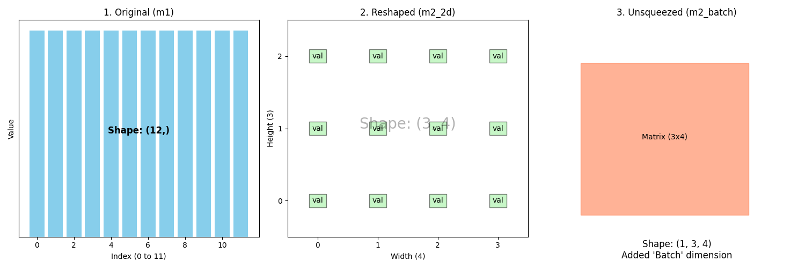

<div align="center">

<!-- 기술 스택 뱃지 -->


<!-- 프로젝트 상태 및 라이선스 뱃지 -->


</div>

<br/>


# 🚀 PyTorch Mission-Driven Learning Challenge

실행 및 코드 검증(`assert`)을 통해 눈으로 직접 결과를 확인하며 학습하는 **PyTorch 핸즈온 미션 프로젝트**입니다.

---

## 🛠️ 환경 설치 (Getting Started)

### 1. Repository 클론 및 가상환경 설정

```bash
git clone https://github.com/hasla-ai/PyTorch_basic_2026.git
cd PyTorch_basic_2026

# 가상환경 생성 및 활성화
python -m venv venv
source venv/bin/activate  # Windows: venv\Scripts\activate
```
### 2. 의존성 패키지 설치 (Requirements Installation)

프로젝트에 필요한 Python 패키지(PyTorch, NumPy 등)를 설치하는 단계입니다.

```bash
pip install -r requirements.txt
```

### 3. Docker로 즉시 실행하기 (선택 사항)

Python 및 라이브러리 설치 등 별도의 가상환경 세팅 없이 Docker만으로 미션을 검증할 수 있습니다.

```bash
# Docker 컨테이너 빌드 및 미션 실행
docker compose up --build
```

## 🧪 미션 실행 및 검증 (Run & Verification)

아래 명령어로 미션 1-4 검증 코드를 실행합니다.


```bash
python mission_pytorch_basics.py
```

🖥️ 기대 실행 결과 (Output)

```bash
==================================================
🚀 PyTorch 텐서 핸즈온 미션 1탄 시작
==================================================

✅ MISSION 1 PASSED!
  • m1 값: tensor([ 1,  2,  3,  4,  5,  6,  7,  8,  9, 10, 11, 12])
  • m1_ones 합계: 12.0


✅ MISSION 2 PASSED!
  • 원본 Shape (1D): torch.Size([12])
  • 2D 변환 Shape  : torch.Size([3, 4])
  • 배치 차원 추가  : torch.Size([1, 3, 4])
  • Squeeze 적용   : torch.Size([3, 4])



  위의 차트는 미션 2에서 수행하신 차원 변화의 흐름을 시각화한 것입니다.
Original (m1): 12개의 원소가 일렬로 늘어선 1차원 벡터입니다.
Reshaped (m2_2d): 데이터를 3행 4열의 2차원 행렬 구조로 재배치했습니다.
Unsqueezed (m2_batch): 2차원 행렬을 하나의 '봉투(Batch)'에 담아 3차원으로 확장했습니다. 겉보기엔 같아 보일 수 있지만, 컴퓨터는 이제 이를 "1개짜리 데이터 묶음"으로 인식합니다.

✅ MISSION 3 PASSED!
  • 감지 및 할당된 장치: cuda (또는 cpu)
  • 텐서 디바이스 위치  : cuda:0 (또는 cpu)
  • NumPy 변환 완료 타입: <class 'numpy.ndarray'>

✅ MISSION 4 PASSED!
  • 추출된 2번째 행: [5, 6, 7, 8]
  • 추출된 3번째 열: [3, 7, 11]

==================================================
🎉 ALL MISSIONS PASSED! 모든 텐서 기본 연산 검증 완료!
==================================================
```

아래 명령어로 미션 5 검증 코드를 실행합니다.


```bash
python mission_autograd.py
```

```bash
==================================================
🚀 PyTorch 핸즈온 미션 5탄: Autograd (자동 미분) 시작
==================================================

✅ MISSION 5-1 PASSED!
  • 입력 x: 3.0
  • y = 2x^2 + 5x + 1 계산 결과: 34.0

✅ MISSION 5-2 PASSED!
  • PyTorch가 계산한 dy/dx (x.grad): 17.0
  • 수학적 해석해 (4x + 5): 17.0

✅ MISSION 5-3 PASSED!
  • backward() 재호출 시 누적된 Gradient: 34.0
  • x.grad.zero_() 후 리셋된 Gradient: 0.0

✅ MISSION 5-4 PASSED!
  • torch.no_grad() 블록 내 z.requires_grad: False

==================================================
🎉 ALL MISSIONS IN MISSION 5 PASSED! Autograd 검증 완료!
==================================================
```

아래 명령어로 미션 6 검증 코드를 실행합니다.


```bash
python mission_dataset.py
```

```bash
==================================================
🚀 PyTorch 핸즈온 미션 6탄: Custom Dataset & DataLoader 시작
==================================================
 
 ✅ MISSION 6-1 PASSED!
  • 데이터셋 전체 샘플 수: 100
  • 첫 번째 샘플 X Shape : torch.Size([10]), y 값: 1
 
 ✅ MISSION 6-2 PASSED!
  • 배치 X Shape: torch.Size([16, 10]) (Batch Size x Feature Size)
  • 배치 y Shape: torch.Size([16])
 
 ✅ MISSION 6-3 PASSED!
  • 1 Epoch 동안 생성된 총 배치 수: 7
  • 마지막 자투리 배치의 크기      : 4

==================================================
🎉 ALL MISSIONS IN MISSION 6 PASSED! Dataset & DataLoader 검증 완료!
 ==================================================
```

아래 명령어로 미션 6 검증 코드를 실행합니다.


```bash
python mission_dataset.py
```

```bash
==================================================
🚀 PyTorch 핸즈온 미션 7탄: nn.Module 기반 인공신경망(MLP) 시작
==================================================

✅ MISSION 7-1 PASSED!
 • 생성된 신경망 모델 레이어 구조:
 SimpleMLP(
 (fc1): Linear(in_features=10, out_features=32, bias=True)
 (relu): ReLU()
 (fc2): Linear(in_features=32, out_features=2, bias=True)
)

 ✅ MISSION 7-2 PASSED!
   • 입력 Shape : torch.Size([16, 10])
   • 출력 Shape : torch.Size([16, 2]) (Batch Size x Output Classes)
 
 ✅ MISSION 7-3 PASSED!
   • Sequential 모델 출력 Shape: torch.Size([16, 2])
   • 첫 번째 선형 레이어 가중치 Shape: torch.Size([32, 10]) (Out Features x In Features)
 
 ==================================================
 🎉 ALL MISSIONS IN MISSION 7 PASSED! nn.Module 신경망 구축 검증 완료!
 ==================================================

## 🗺️ 미션 로드맵(Roadmap)과 체크 리스트

[x] **Mission 1**: PyTorch 텐서 기본 연산, 차원 변경, Device 및 NumPy 변환(`mission_pytorch_basics.py`)
[x] **Mission 2**: Autograd(자동 미분) 및 손실(Loss) 최적화 루프(`mission_autograd.py`)
[x] **Mission 3**: Custom Dataset과 DataLoader 구축(`mission_dataloader.py`)
[x] **Mission 4**: Simple Neural Network 전체 학습 및 평가(`mission_nn_training.py`)
[x] **Mission 5**: Autograd (자동 미분) & 손실 최적화 원리 검증(`mission_autograd.py`)
[x] **Mission 6**: Custom Dataset & DataLoader 구축 (`mission_dataset.py`)
[x] **Mission 7**: `nn.Module` 기반 인공신경망(MLP) 모델 구현(`mission_model.py`)
[ ] **Mission 8**: Loss Function & Optimizer (SGD/Adam)